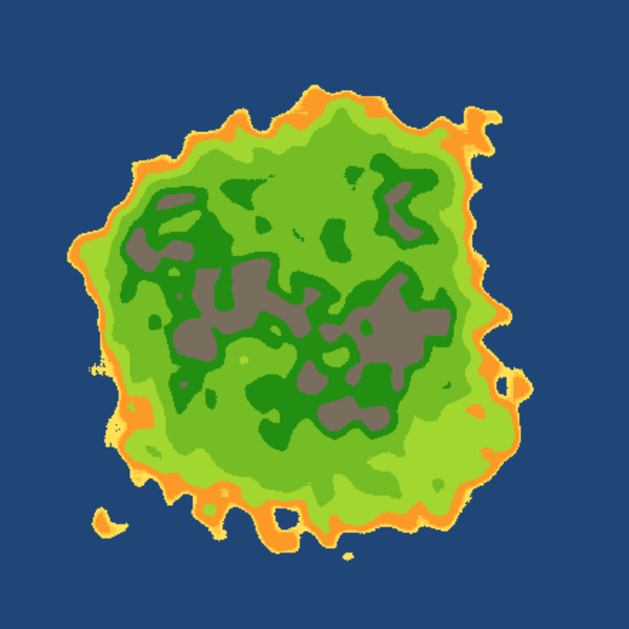

# Godot4_2D_Island_OpenSimplexNoise
Procedural island generation in 2D with OpenSimplexNoise ( Godot 4 )

Updated code from David Art ([adcomp](https://github.com/adcomp) to Godot 4 (made with 4.4.dev7 release)

Notes: 
* I didn't keep the tool script as it was originally
* Noise conversion is not garanteed to be 100% identical, I picked FBM fractal type for instance and result looks pretty much the same as it was before in Godot 3 with the noise algorythm used back then, for a faifthful conversion, a thourough comparison between what was used in Godot 3 and port to the new FastNoiseLite in Godot 4 would be required. But would it worth it ?
* I've add buttons to regenerate a diffrente island and save current noise parameters to a file if you like the one you've got (beware, index of last file is not saved !)

Possible improvements:
* use island mask texture size as reference for target size, currently only 512x512 map is generated regardless of mask input size

Video : https://www.youtube.com/watch?v=kUm7eLfmmS0

Godot 3 version result sample:

Updated version sample:

(the noisy result comes from different octaves & lacunarity values used for this island)
